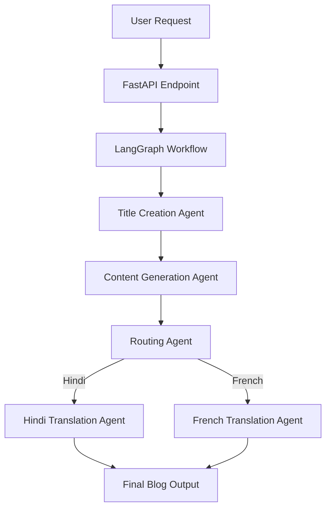

# 🧠 Blog Generation Agentic AI System

An **Agentic AI-powered blog generation platform** built using **LangGraph**, **FastAPI**, and **LLMs**, capable of generating high-quality blogs and dynamically translating them into multiple languages through a **stateful multi-agent workflow**.

---

## 🚀 Project Overview

Traditional AI applications call a single LLM to generate content.
This project demonstrates a **true Agentic AI system**, where multiple specialized agents collaborate inside a structured workflow.

The system:

* Generates an SEO-ready blog title
* Writes detailed blog content
* Routes execution dynamically based on user input
* Translates the blog into the requested language
* Maintains state across agents using **LangGraph**

This showcases **real-world AI orchestration**, not just prompt-based generation.

---

## ✨ Key Features

✅ Agent-based blog generation
✅ Stateful workflow orchestration using LangGraph
✅ Dynamic language routing
✅ Multi-language translation support
✅ Modular agent design
✅ FastAPI backend API
✅ LangSmith observability & tracing
✅ Environment-secured API management
✅ Production-ready project structure

---

## 🏗️ System Architecture



---

## 🤖 Agent Workflow

The system is built around **specialized AI agents**:

### 1️⃣ Title Creation Agent

* Generates a creative and SEO-friendly blog title.

### 2️⃣ Content Generation Agent

* Produces structured blog content using Markdown formatting.

### 3️⃣ Routing Agent

* Dynamically decides execution flow based on requested language.

### 4️⃣ Translation Agent

* Translates blog content while preserving tone, structure, and formatting.

Each agent operates independently while sharing a **global state**.

---

## 🧰 Tech Stack

| Category            | Technology |
| ------------------- | ---------- |
| LLM Orchestration   | LangGraph  |
| Backend API         | FastAPI    |
| LLM Provider        | Groq       |
| Observability       | LangSmith  |
| Language            | Python     |
| Environment Manager | uv         |
| API Server          | Uvicorn    |

---

## 📂 Project Structure

```
Blog-Generation-Agentic-AI-System/
│
├── app.py
├── requirements.txt
├── .env.example
│
├── src/
│   ├── graphs/
│   │   └── graph_builder.py
│   │
│   ├── nodes/
│   │   └── blog_node.py
│   │
│   ├── states/
│   │   └── blogstate.py
│   │
│   └── llms/
│       └── groqllm.py
│
└── README.md
```

---

## ⚙️ Installation

### 1. Clone Repository

```bash
git clone https://github.com/Tush2602/Blog-Generation-Agentic-AI-System-.git
cd Blog-Generation-Agentic-AI-System-
```

---

### 2. Create Virtual Environment (uv)

```bash
uv venv
```

Activate:

```bash
.venv\Scripts\activate
```

---

### 3. Install Dependencies

```bash
uv add -r requirements.txt
```

---

### 4. Setup Environment Variables

Create `.env` file:

```
GROQ_API_KEY=your_groq_key
LANGCHAIN_API_KEY=your_langsmith_key
```

*(Never commit `.env` to GitHub)*

---

## ▶️ Running the Application

Start FastAPI server:

```bash
python app.py
```

Server runs at:

```
http://localhost:8000
```

---

## 📡 API Usage

### Generate Blog

**Endpoint**

```
POST /blogs
```

### Request Body

```json
{
  "topic": "AI Agents",
  "language": "french"
}
```

---

### Example Response

```json
{
  "topic": "AI Agents",
  "blog": {
    "title": "Les Agents IA : L’avenir de l’intelligence autonome",
    "content": "...translated blog content..."
  },
  "current_language": "french"
}
```

---

## 🔎 Observability with LangSmith

The system integrates **LangSmith** for:

* Execution tracing
* Agent debugging
* Workflow visualization
* Performance monitoring

Every agent step can be inspected through LangSmith dashboards.

---

## 🧠 Why Agentic AI?

Instead of one monolithic prompt, this system demonstrates:

* Task decomposition
* Agent collaboration
* Stateful reasoning
* Dynamic routing

This mirrors real production AI systems used in modern AI products.

---

## 🔐 Security Practices

* API keys stored using environment variables
* `.env` excluded via `.gitignore`
* Secrets removed from repository history
* Production-safe configuration

---

## 🌍 Future Improvements

* Auto language detection
* Multi-agent editing & review pipeline
* Streaming responses
* Frontend interface
* Memory-enabled agents
* Blog publishing integrations

---

## 👨‍💻 Author

**Tushar Joshi**

B.Tech Electrical Engineering — Punjab Engineering College
Aspiring Data Scientist & AI Systems Engineer

GitHub: https://github.com/Tush2602

---

## ⭐ Acknowledgements

* LangGraph
* LangChain Ecosystem
* Groq LLM API
* FastAPI Community

---

## 📜 License

This project is licensed under the MIT License.

---
---

## ⭐ Support

If you found this project useful:

- ⭐ Star the repository  
- 🍴 Fork and build your own agents  

---

## 🧠 Built With Passion for Agentic AI

> *Building intelligent systems through agentic workflows.*
